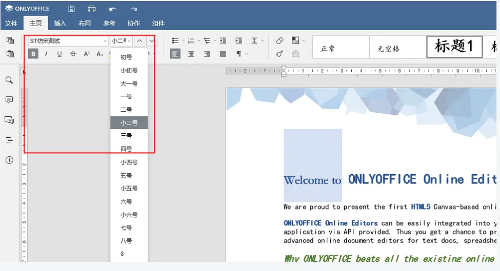

# onlyoffice
>  逐渐更新中。。。
> ### todo list:
>> #### a. example改造为spring（20200327已完成，见git@github.com:ToBigToSmall/onlyoffce-example-spring.git）
>> #### b. 加入文件服务(尽可能通用化)
>> #### c. 加入editor和index的权限控制
>> #### d. 修改一些中文版本的bug
## 1. 关于onlyoffice documentserver 中文优化
### 1.1. 优化点
> #### onlyoffice 界面的汉化
> #### onlyoffice 字体及重命名
> #### onlyoffice 中文字号编辑
> #### onlyoffice spell checker 去除
### 结果图展示

### 1.2. 正文
#### 1.2.1. 用法介绍
##### a. 快速体验
注意：目前提供打包好的镜像只是个效果镜像，不提供真正实际使用场景

`docker build -t onlyoffice-documentserver-chinese .`

`docker run -i -t -d -p 80:80 --name onlyoffice-documentserver-chinese onlyoffice-documentserver-chinese`

##### b. 手动修改
自己build镜像，修改字体、字号、bug、配置文件，目前提供的web-apps是修改过的文件，已经增加了字号，若还想自己编辑这些功能，请参考链接：https://www.douban.com/note/754817950/
+ 关于字体，提供的winfont的字体是修改名称后的字体
+ 关于字号，提供的默认字号是修改过的默认字号
+ bug主要是自己中文翻译的问题，已经处理
+ 配置文件，根据自己需求修改的，也参考官网提供的资料

### 1.3. 参考资料
> 1. 官方：https://github.com/ONLYOFFICE/DocumentServer
> 2. 官方demo: https://api.onlyoffice.com
> 3. https://github.com/hqzhen/DemoOfOnlyoffice 

## 2. 接入onlyoffice documentserver前置服务
### 2.1. 功能说明
+ 提供了接入服务的前置服务(onlyoffice-java-example)

## 回滚测试

## 回滚测试2

## 回滚测试3

## 回滚测试4
